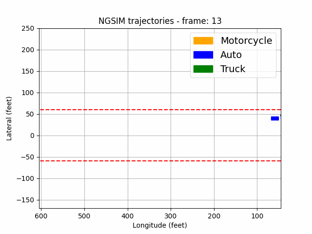
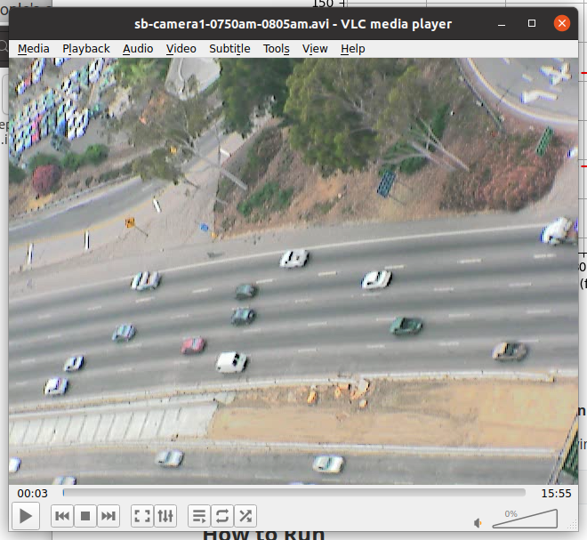
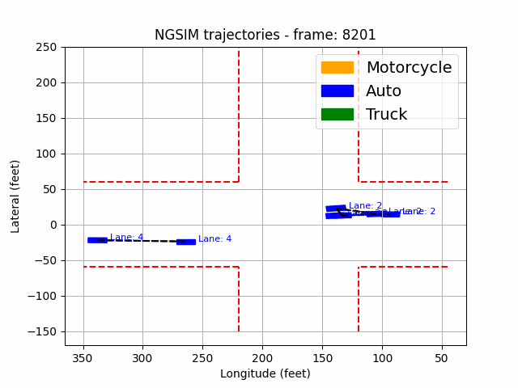
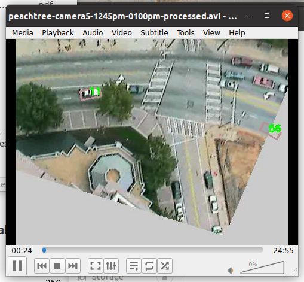

# Vehicle-Prediction

### Install

git clone the repo:

```
git clone https://github.gatech.edu/24fall-ml-group37/Vehicle-Prediction
cd Vehicle-Prediction
```

Create a folder for dataset

```
mkdir dataset
cd dataset
```

Download the dataset

**US101 Dataset:**

```
wget https://data.transportation.gov/api/views/8ect-6jqj/files/bf7ca201-c7b3-4dc0-8f77-578f7794fcee?download=true&filename=US-101-LosAngeles-CA.zip
```

**I-80 Dataset:**

```
wget https://data.transportation.gov/api/views/8ect-6jqj/files/10ed9f47-ab08-4df2-b46a-29f1683ceffa?download=true&filename=I-80-Emeryville-CA.zip
```

**Peachtree Street Dataset:**

```
https://data.transportation.gov/api/views/8ect-6jqj/files/26d0597d-8153-4a25-af6b-7f2ec1ea7d8f?download=true&filename=Peachtree-Street-Atlanta-GA.zip
```

Extract them

**It is strongly recommended to create a virtual environment for this project via anaconda**

And then, install all dependencies according to the following command

```
pip install -r requirements.txt
```

### How to Run

```
python main.py --dataset="your dataset path"
```

### Tree
```
.
├── CHANGELOG.md
├── dataset: NGSIM Dataset
│   ├── Lankershim-Boulevard-LosAngeles-CA: I80 dataset
│   ├── Peachtree-Street-Atlanta-GA: Peachtree dataset
│   ├── US-101-LosAngeles-CA: US101 dataset
├── EDA
│   └── EDA.ipynb: The implement of data analysis
├── GMM
│   └── gmm.ipynb: The implement of GMM
├── img: Store images
├── Linear_Regression
│   └── LinearRegression.ipynb: The implement of linear regression
├── LSTM
│   ├── evaluate.py: The evalution of LSTM
│   ├── LSTM_setting.yaml: The parameter setting for LSTM
│   ├── model.py: The model of LSTM
│   ├── train.py: The implement of LSTM training
│   └── utils.py: The implement of LSTM help function
├── lstm_ckpt_output: The checkpoint of LSTM
├── main.py: Main function for preprocessing and LSTM
├── multithread_featureprocess.py: The implement of preprocessing function, including multi-threading and multi-process
├── pkl_output: Storing the preprocessed dataset
├── preprocess.ipynb: Partial implementation of preprocessing (no longer used)
├── preprocess_setting.yaml: The parameter setting for preprocess
├── README.md
├── requirements.txt
├── summary: The tensorboardX recording for LSTM training process
```
### Preprocess Data

Read the data in the csv file, process the data, divide the processed data into training set, test set and validation set and store them in .pkle file
- Data Cleaning
- Feature Engineering
- Data Transformation

The preprocessed data can be downloaded from here: https://drive.google.com/drive/folders/1Ui9fl6bPqiul63I7Y-azlJ8ZV_pcN763?usp=sharing

|      Data      | Description                                                  |
| :------------: | ------------------------------------------------------------ |
|   Vehicle_ID   | Vehicle identification number                                |
|    Frame_ID    | Frame Identification number                                  |
|  Global_Time   | Elapsed time in milliseconds since Jan 1, 1970.              |
|    Local_X     | Lateral (X) coordinate of the front center of the vehicle in feet with respect to the left-most edge of the section in the direction of travel. |
|    Local_Y     | Longitudinal (Y) coordinate of the front center of the vehicle in feet with respect to the entry edge of the section in the direction of travel. |
|    v_length    | Length of vehicle in feet                                    |
|    v_Width     | Width of vehicle in feet                                     |
|    v_Class     | Vehicle type: 1 - motorcycle, 2 - auto, 3 - truck            |
|     v_Vel      | Instantaneous velocity of vehicle in feet/second.            |
|     v_Acc      | Instantaneous acceleration of vehicle in feet/second square. |
|    Lane_ID     | Current lane position of vehicle.                            |
|     Int_ID     | Intersection in which the vehicle is traveling.              |
|   Section_ID   | Section in which the vehicle is traveling.                   |
|   Direction    | Moving direction of the vehicle. 1 - east-bound (EB), 2 - north-bound (NB), 3 - west-bound (WB), 4 - south-bound (SB). |
|    Movement    | Movement of the vehicle. 1 - through (TH), 2 - left-turn (LT), 3 - right-turn (RT). |
| Grid_Neighbors | The neighbors of ego at the same frame                       |
| Space_Headway  | Spacing provides the distance between the frontcenter of a vehicle to the front-center of the preceding vehicle. |
|  Time_Headway  | Time Headway provides the time to travel from the front-center of a vehicle (at the speed of the vehicle) to the front-center of the preceding vehicle. |
|    Location    | Name of street or freeway                                    |
|     Theta      | The yaw of vehicle                                           |


### Data Visualization

#### Visualize the traffic flow on US-101, Los Angeles, CA from 7:50 am to 8:05 am





#### Visualize the traffic flow on peachtree street, Atlanta, GA





The black dashed line is the neighbor relationship obtained after feature engineering.

### LSTM Result


### Run

#### LSTM
Refer to `LSTM` folder

#### Linear Regression
Refer to `Linear_Regression/LinearRegression.ipynb`

#### GMM
Refer to `GMM/gmm.ipynb`

### Submission Specifications

- To indicate the content of each modification, please complete the content in CHANGELOG.md before each submission.

- To avoid code clutter and bugs, we should upload our own branches to GitHub every time. To distinguish our branches, we use our usernames as branch names. After uploading the branch, we check whether our changes will affect other people's code. After checking, merge it into the main branch.
